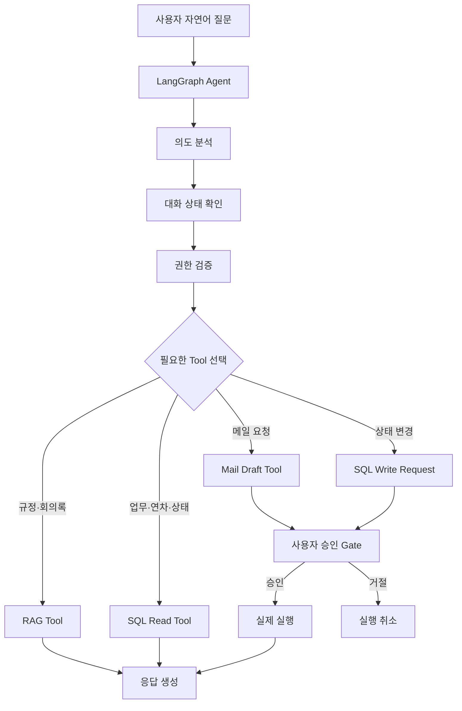

# AI Office Assistant
### 자연어 질문으로 사내 정보를 조회하고, 필요한 경우 실제 후속 업무까지 수행하는 LangGraph 기반 생성형 AI 업무비서

KT AIVLE School 프로젝트를 포트폴리오용으로 재구성한 프로젝트입니다.

사용자의 질문을 분석해 **정형 데이터는 SQL DB**, **비정형 문서는 Vector DB(RAG)** 에서 조회하고,  
메일 발송·업무 상태 변경처럼 실제 업무에 영향을 주는 작업은 **LangGraph `interrupt()` 기반 사용자 승인** 후 실행하도록 설계했습니다.

> 핵심 목표: 단순 질의응답을 넘어  
> **자연어 질문 → 의도 판단 → 데이터 조회 → Tool 선택 → 사용자 승인 → 실제 업무 실행**  
> 으로 이어지는 업무 자동화 Agent 구현

---

## 1. 주요 기능

| 사용자 요청 예시 | 처리 방식 |
|---|---|
| `"오늘 연차자 누구야?"` | SQL DB의 연차 데이터 조건 조회 |
| `"이번 주 마감 업무 뭐 있어?"` | SQL DB 날짜 범위 조회. 일반 사용자는 본인 업무, `lead`는 팀 범위 조회 |
| `"출장비 규정 알려줘"` | Vector DB에서 사내 규정 RAG 검색 |
| `"김대리가 맡은 업무 알려줘"` | SQL DB 담당자 조건 조회 |
| `"그중 아직 안 끝난 거 있어?"` | 이전 대화의 담당자 맥락을 유지해 후속 질문 처리 |
| `"1번 업무 완료 처리해줘"` | 담당자 권한 확인 → `interrupt()` → 승인 후 상태 변경 |
| `"회의 결과 김대리에게 보내줘"` | 관련 정보 조회 → 메일 초안 생성 → 사용자 승인 → 발송 |

회의 음성 파일이 입력되면 다음 파이프라인으로 처리합니다.

```text
회의 음성
   ↓
STT
   ↓
LLM 구조화 추출
(요약 / 담당자 / 업무 / 마감일)
   ↓
엔티티 정규화
(이름 → 사번)
   ↓
사용자 검증
   ↓
SQL DB / Vector DB 저장
```

---

## 2. System Architecture



읽기 작업은 바로 처리하지만, **메일 발송과 업무 상태 변경 같은 쓰기 작업은 사용자 승인 이후에만 실행**됩니다.

---

## 3. 설계 포인트

### 3-1. 정형 데이터와 비정형 데이터 분리

모든 정보를 하나의 저장소에서 검색하지 않았습니다.

- **SQL DB**: 담당자, 업무, 마감일, 상태, 연차 등 정확한 조건 조회가 필요한 데이터
- **Vector DB**: 회의록, 사내 규정 등 의미 기반 검색이 필요한 비정형 문서

질문과 데이터 특성에 따라 조회 방식을 달리하여 검색 정확성과 활용성을 높였습니다.

### 3-2. LangGraph 기반 Tool Orchestration

Agent가 사용자의 의도를 분석한 뒤 RAG, SQL, Mail Tool 중 필요한 기능을 선택하도록 구성했습니다.

하나의 요청에 여러 작업이 필요한 경우에도 각 Tool을 순차적으로 연결할 수 있도록 설계했습니다.

### 3-3. Multi-turn Conversation

`MemorySaver`와 `thread_id`를 이용해 대화 상태를 유지합니다.

예를 들어,

```text
사용자: 김대리 업무 알려줘
Agent: ...

사용자: 그중 아직 안 끝난 거 있어?
```

처럼 두 번째 질문에 담당자 이름이 다시 등장하지 않아도 이전 맥락을 활용해 처리할 수 있습니다.

### 3-4. 권한 검증

권한 판단을 LLM 프롬프트에만 맡기지 않고 **Tool 실행 전 코드 레이어에서 검증**합니다.

- `member`: 본인 업무 조회·변경
- `lead`: 팀 범위 업무 조회

담당자가 명시되지 않은 `"이번 주 마감 업무"` 같은 요청도 일반 사용자는 본인 범위로 제한합니다.

### 3-5. Human-in-the-loop

메일 발송이나 업무 상태 변경은 AI가 바로 실행하지 않습니다.

```text
Agent 판단
   ↓
메일 초안 / 상태 변경 요청 생성
   ↓
LangGraph interrupt()
   ↓
사용자 확인
   ↓
Command(resume=...)
   ↓
실제 실행
```

특히 메일은 **초안을 먼저 사용자에게 보여준 뒤 승인된 경우에만 발송**하도록 구성했습니다.

### 3-6. 엔티티 정규화

LLM이 추출한 `"김대리"` 같은 텍스트를 그대로 저장하지 않고 실제 직원 레코드와 매핑합니다.

```text
김대리
  ↓
직원 후보 검색
  ↓
사번 매핑
  ↓
확정된 담당자 정보 저장
```

매칭이 모호한 경우에는 사람의 확인을 거치도록 설계했습니다.

---

## 4. Tech Stack

| 영역 | 기술 |
|---|---|
| Language | Python |
| Agent | LangGraph |
| LLM / STT | OpenAI API / Whisper |
| RAG | ChromaDB |
| Structured Data | SQLite |
| Configuration | python-dotenv |
| Approval | LangGraph `interrupt()` / `Command(resume=...)` |

기본 실행은 `MOCK_MODE=true`로 제공하며, API Key 없이 전체 흐름을 확인할 수 있도록 구성했습니다.

---

## 5. Project Structure

```text
ai-office-assistant/
├── agent/
│   ├── graph.py              # LangGraph Agent
│   └── tools.py              # RAG / SQL / Mail Tool
│
├── docs/
│   └── ARCHITECTURE.md       # 상세 아키텍처 및 설계 설명
│
├── sample_data/
│   ├── meeting_transcript.txt
│   ├── policy_travel_expense.txt
│   └── policy_annual_leave.txt
│
├── config.py                 # 환경설정 / MOCK_MODE
├── db.py                     # 업무·담당자·연차 등 SQL DB
├── vector_store.py           # 회의록·규정 Vector DB
├── stt.py                    # 회의 음성 STT
├── extract.py                # LLM 기반 구조화 추출
├── entity_resolution.py      # 이름 → 사번 정규화
├── main.py                   # 전체 파이프라인 및 Agent 데모
├── requirements.txt
├── .env.example
└── README.md
```

---

## 6. Quick Start

```bash
git clone https://github.com/rlaqhfla0917-bit/ai-office-assistant.git
cd ai-office-assistant

python -m venv .venv
```

Windows:

```bash
.venv\Scripts\activate
```

macOS / Linux:

```bash
source .venv/bin/activate
```

패키지 설치 및 실행:

```bash
pip install -r requirements.txt
python main.py
```

기본값은 `MOCK_MODE=true`입니다.

실제 LLM / STT 경로를 사용하려면 `.env.example`을 참고해 `.env`에 API Key를 설정하고 `MOCK_MODE=false`로 변경합니다.

---

## 7. Mock Mode와 실제 연동

| 기능 | Mock Mode | 실제 연동 |
|---|---|---|
| STT | 샘플 텍스트 사용 | Whisper API |
| 구조화 추출 | 규칙 기반 데모 | LLM JSON 출력 |
| Vector Search | 간단한 검색 fallback | ChromaDB |
| Agent | LangGraph 그래프 실행 | 동일 |
| 대화 상태 | `MemorySaver` | 동일 |
| 사용자 승인 | CLI 기반 승인 | Web / Slack / Teams 등으로 확장 가능 |
| 메일 | 콘솔 출력 | SMTP / Mail API |

---

## 8. 프로젝트에서 고민한 점

이 프로젝트의 핵심은 LLM을 한 번 호출하는 것이 아니라 **기업 업무에 필요한 데이터와 실행 도구를 어떻게 안전하게 연결할 것인가**였습니다.

따라서 다음 세 가지를 중심으로 설계했습니다.

1. **데이터 성격에 따라 SQL과 RAG를 분리**
2. **Agent가 필요한 Tool을 선택하고 여러 작업을 연결**
3. **실제 업무에 영향을 주는 행동에는 사용자 승인 적용**

이를 통해 AI를 단순 문서 검색 챗봇이 아니라 **정보 탐색·판단·실행을 연결하는 업무 Agent**로 확장했습니다.

---

## 9. Roadmap

- Web UI 기반 비동기 Human-in-the-loop 승인
- LLM 기반 의도 분류 및 Structured Tool Calling 고도화
- 연차 조회에서 신청·승인 업무까지 확장
- 마감 임박 업무 자동 탐지 및 알림
- 사내 신규 문서 자동 임베딩 파이프라인

---

## License

MIT License
