# 시스템 아키텍처

## 전체 흐름

```mermaid
flowchart TD
    subgraph INPUT["사용자 입력"]
        A1["자연어 질문\n텍스트 채팅"]
        A2["회의 음성 파일\n업로드"]
    end

    subgraph PRE["회의 전처리"]
        B1["STT 변환\nWhisper API"]
        B2["LLM 구조화 추출\n요약·담당자·업무·마감일"]
        B3["엔티티 정규화·검증\n이름→사번 / 사람 확인"]
    end

    subgraph STORE["저장 레이어"]
        C1[("SQL DB\n업무·연차·권한·상태")]
        C2[("Vector DB\n회의록·사내 규정")]
    end

    subgraph AGENT["LangGraph Agent"]
        D1["의도·대화 맥락 분석"]
        D2["권한 검증\nmember / lead"]
        E1["RAG 검색\n규정·회의록"]
        E2["SQL 조회\n업무·연차·상태"]
        E3["메일 초안 생성"]
        E4["업무 상태 변경 요청"]
    end

    F["사용자 승인 게이트\nLangGraph interrupt()"]
    H1["메일 발송"]
    H2["SQL UPDATE"]
    G["응답 생성\n조회 결과 / 실행 결과"]

    A2 --> B1 --> B2 --> B3
    B3 --> C1
    B3 --> C2

    A1 --> D1 --> D2
    D2 --> E1
    D2 --> E2
    D2 --> E3
    D2 --> E4

    C2 --> E1
    C1 --> E2
    C1 --> E3
    C1 --> E4

    E1 --> G
    E2 --> G
    E3 --> F
    E4 --> F
    F -->|승인| H1 --> G
    F -->|승인| H2 --> G
    F -->|거부| G
```

## 레이어 설명

### 1. 입력
- 자연어 질문과 회의 음성 파일을 서로 다른 경로로 처리합니다.
- 텍스트 질문은 바로 Agent로 전달되고, 회의 음성만 STT·구조화 추출 파이프라인을 거칩니다.

### 2. 회의 전처리
- **STT 변환**: 회의 음성을 텍스트로 변환합니다.
- **LLM 구조화 추출**: 회의 텍스트에서 요약, 담당자, 업무, 마감일을 구조화합니다.
- **엔티티 정규화**: "김대리" 같은 원문 이름을 실제 인물 레코드와 사번으로 연결합니다.
- 저장 전에 사람이 추출 결과를 검토하는 Human-in-the-loop 단계를 둡니다.

### 3. 저장 레이어
- **SQL DB**: 담당자, 업무, 마감일, 상태, 연차, 권한처럼 정확한 조건 조회가 필요한 정형 데이터.
- **Vector DB**: 회의록 원문·요약, 사내 규정처럼 의미 기반 탐색이 필요한 비정형 문서.
- 예를 들어 "오늘 연차자 누구야?"는 SQL, "출장비 규정 알려줘"는 RAG로 처리합니다.

### 4. LangGraph Agent
- 질문의 의도와 이전 대화 맥락을 확인하고, Tool 실행 전에 사용자 권한을 코드로 검증합니다.
- `member`는 본인 업무만 조회·변경할 수 있고 `lead`는 팀 범위를 조회할 수 있습니다.
- 담당자 없이 "이번 주 마감 업무"라고 묻는 경우에도 일반 사용자는 본인 업무로 범위를 제한합니다.
- "김대리 업무 중 아직 안 끝난 것" 같은 질문은 **회의 문맥(RAG)** 과 **현재 업무 상태(SQL)** 를 각각 조회한 뒤 두 결과를 한 답변에서 함께 사용합니다.
- `MemorySaver` 체크포인터로 `thread_id`별 상태를 유지해 "그중 아직 안 끝난 거 있어?"처럼 이어지는 질문에서 직전 담당자를 재사용합니다.

### 5. 사용자 승인 게이트
- RAG 검색, SQL 조회 같은 읽기 작업은 승인 없이 바로 응답합니다.
- 메일 발송과 업무 상태 변경처럼 실제 상태를 바꾸는 작업만 `interrupt()`로 그래프를 중단합니다.
- **메일은 초안을 먼저 생성해 수신자·제목·본문을 사용자에게 보여준 뒤 승인되었을 때만 발송**합니다.
- 업무 상태 변경도 대상 업무와 담당자를 확인한 뒤 승인된 경우에만 SQL UPDATE를 실행합니다.

### 6. 응답 생성
- 읽기 Tool 결과 또는 승인 후 실행 결과를 사용자에게 반환합니다.
- 사용자가 승인을 거부하면 외부 작업이나 DB 변경 없이 취소 메시지만 반환합니다.

## 현재 코드와의 대응

- `classify_node`: 질문 의도 분석 + 멀티턴 담당자 맥락 반영
- `permission_node`: 본인/팀장 권한 검증, 날짜 범위 조회 scope 제한, 상태 변경 대상 업무 담당자 확인
- `execute_read_node`: 연차·마감·담당자 업무 SQL 조회 및 RAG 검색
- `approval_node`: 메일 초안 생성 후 미리보기, 상태 변경 미리보기, `interrupt()` 실행
- `execute_action_node`: 승인 후 메일 발송 또는 SQL 상태 변경
- `synthesize_node`: 조회/실행 결과 응답

`MemorySaver`와 `Command(resume=...)`를 사용해 동일 `thread_id`에서 대화 상태와 승인 재개 상태를 유지합니다.
